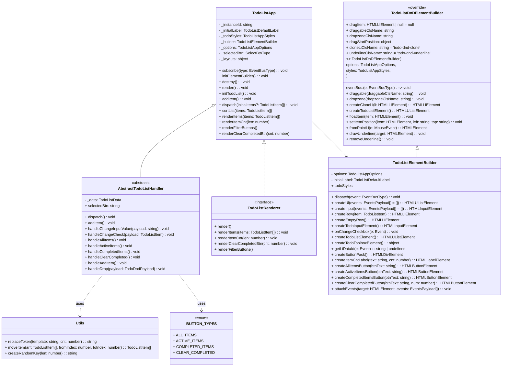

# 프로젝트 실행 방법

### 요구사항

- Node.js v20 (하위 호환 확인필요!)
- npm

### 1. 의존성 설치

```
npm install
```

### 2. 개발 서버 실행

| **기능**                | **설치 명령어**                   |
| ----------------------- | --------------------------------- |
| 번들/개발서버           | `npm run dev` / `npm run dev`     |
| ts 체크                 | `npm run typecheck`               |
| 린팅/포맷팅             | `npm run lint` / `npm run format` |
| 유닛 테스트 (Jest)      | `npm run test`                    |
| E2E 테스트 (Playwright) | `npm run e2e`                     |
| E2E 테스트 show-report  | `npm run e2e:report`              |
| E2E 테스트 ui 모드      | `npm run e2e:ui`                  |
| Storybook               | `npm run storybook`               |

### 3. src

```
├── components
│ ├── todo-list-dnd-element-builder.components.ts
│ ├── todo-list-element-builder.components.ts
│ ├── todo-list-renderer.component.ts
│ └── todo-list-styles.components.ts
├── constants
│ └── todo-list.const.ts
├── index.css
├── index.ts
├── models
│ └── todo-list.interface.ts
├── stories
│ ├── InputSection.stories.ts
│ ├── ListSection
│ │ ├── NoTodoItems.stories.ts
│ │ ├── TodoListWithCheckedItem.stories.ts
│ │ └── TodoListWithItem.stories.ts
│ ├── StatusSection.stories.ts
│ └── TodoListApp.stories.ts
├── todo-list
│ ├── todo-list.spec.ts
│ └── todo-list.ts
└── types
└── todo.types.ts
```

## 초기 세팅 참고

npm init -y

- 번들/개발서버
  - npm i -D webpack webpack-cli webpack-dev-server html-webpack-plugin

- 바벨(ES2015+ → 테스트/번들 공통 변환)
  - npm i -D @babel/core @babel/preset-env babel-loader

- 린팅/포맷팅
  - npm i -D eslint prettier eslint-config-prettier eslint-plugin-import

- 유닛 테스트(Jest)
  - npm i -D jest babel-jest jest-environment-jsdom @testing-library/dom @testing-library/jest-dom

- E2E(Playwright)
  - npm i -D @playwright/test start-server-and-test

- 스타일/에셋(옵션: CSS 사용 시)
  - npm i -D style-loader css-loader

- Storybook 8+ (HTML 템플릿)
  - npx storybook@latest init --type html

- 타입스크립트 관련 추가 세팅
  - npm i -D typescript

- npm i -D eslint @eslint/js typescript-eslint eslint-config-prettier \
  eslint-plugin-import eslint-import-resolver-typescript globals

- Prettier
  - npm i -D prettier

- Babel (브라우저/테스트 공통 트랜스파일) + TS 프리셋
  - npm i -D @babel/core @babel/preset-env @babel/preset-typescript babel-jest

- webpack + 로더/플러그인
- npm i -D webpack webpack-cli webpack-dev-server html-webpack-plugin \
  babel-loader css-loader style-loader

- 테스트(Jest)
  - npm i -D jest jest-environment-jsdom @testing-library/dom @testing-library/jest-dom

- E2E(Playwright)
  - npm i -D @playwright/test start-server-and-test

# 요구 사항 메모

## 기본 동작

- 내는 TO-DO 입력부와 TO-DO 목록 출력부, 정보 출력부로 나뉜다.
- TO-DO는 [완료 전], [완료] 두 가지 상태를 가진다. (기본값 : 완료 전)
  TO-DO 입력부
- TO-DO 입력 받을 수 있는 input 요소가 있다.
- 텍스트로 TO-DO를 입력하고 Enter키를 누르면 TO-DO를 등록할 수 있다.
- 등록된 TO-DO는 TO-DO 목록 상단에 추가되며, 등록과 동시에 입력했던 TO-DO 텍스트의 내용은 초기화된다.
  TO-DO 목록 출력부
- 등록된 TO-DO 목록이 출력된다.
- TO-DO는 등록순으로 정렬되어 최근에 등록한 TO-DO 항목이 목록의 상단에 위치한다.
- TO-DO는 아래와 같이 구성된다.
- 완료 여부를 나타내는 checkbox 요소가 있다.
- TO-DO 내용을 나타내는 텍스트가 표시된다.
- 체크박스를 클릭하여 완료 처리할 수 있으며, 토글 방식으로 상태를 변경할 수 있다.
- 체크 : [완료]
- 체크해제 : [완료 전] - 기본값
- 완료된 TO-DO는 TO-DO 목록의 하단으로 이동하며, 이미 완료된 TO-DO를 다시 [완료 전] 상태로 변경하면 TO-DO 목록 상단으로 다시 이동한다.
- TO-DO목록은 ul 요소 하나만 사용한다.
- 완료된 TO-DO 항목은 취소선과 폰트 컬러를 변경하여 시각적으로 다르게 표시한다.
  하단 정보 출력부
- 현재 남아있는 완료 전 TO-DO 항목의 갯수를 출력한다.
- [전체], [완료 전], [완료됨] 의 탭으로 TO-DO 목록을 필터해 볼 수 있는 기능을 제공한다.
- 완료 항복 삭제 기능을 제공한다.

## 이슈 정리

### 스토리북 세팅 문제

- @storybook/html-webpack5 미설치, main.ts 누락 문제
  - 설치확인: npm ls @storybook/html-webpack5
  - npm i -D @storybook/html-webpack5 @storybook/addon-essentials storybook
  - .storybook/main.ts 생성

- Storybook HTML 프레임워크 기본 설정에는 TS 처리용 babel/loader 규칙이 없어서 import type { Meta, StoryObj } from '@storybook/html';
  구문 포함 TS 파일을 그대로 파싱하다가 실패.
  - main.ts에 webpackFinal 추가: babel-loader + preset-env + preset-typescript 설정, alias src 추가.

- 'src/...' 경로는 현재 Storybook webpack 설정에서 alias 미설정.
  - 경로를 상대경로로 변경

### prettier 누락 관련

- settings.json 파일을 통해 적용했던 기존 내용 변경
- "[typescript]": { "editor.defaultFormatter": "vscode.typescript-language-features"}
  - "[typescript]": { "editor.defaultFormatter": "esbenp.prettier-vscode" },

### devtool 옵션 관련

- source-map -> eval-cheap-module-source-map
- 디버기
  | 옵션 | 빌드 속도 | 디버깅 정확도 |
  |------------------------------|-----------|------------------------|
  | eval-cheap-module-source-map | 빠름 | 줄 단위까지만 (cheap)
  | source-map | 느림 | 줄 + 열 단위 (정확함)
- 디버깅시 source map 과 브레이크 포인트의 위치가 안맞는 문제가 있어 롤백

### jest 렌더링 관련

- jest + jsdom 환경에서 label.innerText → 기대한 값이 안 나올 수 있음
- 대신 label.textContent 또는 label.innerHTML을 사용하세요.
- 테스트에서 텍스트 확인은 보통 textContent를 쓰는 게 가장 안전합니다.

### 스토리북에서 css변수 사용을 위한 전역 css 올리기 실패

- 아래 코드로 실패

```
c.module.rules.push({
  test: /\.css$/,
  use: ['style-loader', 'css-loader'],
  include: path.resolve(\_\_dirname, '../src'),
});
```

### 실행환경 오류 관련 정리

```
- .npmrc engine-strict=true 의미 : package.json 의 engines 요구 조건을 강제함
- nvm install 을 하면 .nvmrc 에 버전이 설치 혹은 use 로 설정됨
- package.json 에 packageManager : yarn 이나 다른 패키지매니저 사용 못 하게 막음
```

### 절대경로 인식 불가 문제

- tsconfig.json path 세팅 누락으로 상대경로에서만 실행가능했던 문제

```
"paths": { "*": ["./*"], "src/*": ["src/*"] },
```

- jest 에서 src/.. 으로 시작하는 경로 인식 못하는 문제

```
  moduleNameMapper: {
    '^src/(.*)$': '<rootDir>/src/$1',
  },
```

# 클래스 관계 다이어그램


